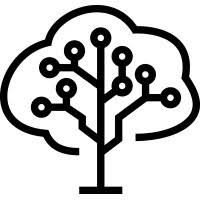

# brainforest 

This repo should give an overview of the datasets collected for [brainforest](https://brainforest.global/)

## Locations
Datasets have been collected at two locations so far (21.08.2020).

1. Waldlabor, Hönggerberg, Zürich, Switzerland
2. Nuss - Baumschule Gubler AG, Hörhausen, Switzerland

### Waldlabor

